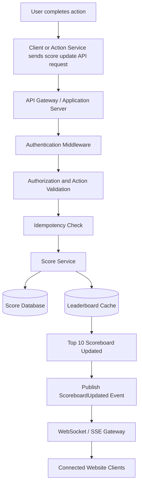

# Live Scoreboard Module Specification

## 1. Overview

The Live Scoreboard Module maintains user scores, applies score updates after authorized action completions, broadcasts live scoreboard changes, and returns the current top 10 users for the website scoreboard.

The module does not decide whether a user completed an action. It receives a score update request after the action is completed, validates that the request is authentic and eligible, records the mutation safely, updates the leaderboard view, and publishes a realtime update to connected clients.

## 2. Goals

- Secure score updates so malicious users cannot increase scores without authorization.
- Real-time scoreboard updates after valid score mutations.
- Low-latency top 10 retrieval for the public website scoreboard.
- Clear API contract for clients, trusted action services, and backend consumers.
- Durable audit trail for every score mutation.

## 3. Non-Goals

- Defining the actual user action logic, such as quiz completion, purchase completion, or task validation.
- Implementing the frontend scoreboard UI.
- Manually editing scores from an admin panel, except as possible future work.
- Defining the full user profile system beyond the fields needed for ranking display.

## 4. Core Concepts

- **User:** An authenticated account that can earn score through completed actions.
- **Action completion:** A verified occurrence of a score-worthy action outside this module.
- **Score increment:** A positive score change applied to one user after an authorized action completion.
- **Scoreboard:** The ranked view of users and their current total scores.
- **Top 10 ranking:** The highest-scoring 10 users returned to clients, ordered by score and deterministic tie-breaking rules.
- **Authorized score update request:** A request from an authenticated user or trusted service that proves the action completion is valid, unused, and eligible for scoring.

## 5. Proposed Architecture

The module should be implemented as a backend service boundary with the following components:

- **Score Update API:** Accepts score mutation requests, exposes top 10 reads, and supports live scoreboard subscriptions.
- **Authentication Middleware:** Verifies user tokens for client requests and service credentials for trusted backend action services.
- **Authorization / Validation Layer:** Confirms the caller is allowed to update the target user, validates action eligibility, checks idempotency, and rejects replay attempts.
- **Score Service:** Owns score mutation logic and transaction boundaries.
- **Score Persistence Layer:** Stores current scores and append-only score events.
- **Leaderboard Query/Cache Layer:** Serves top 10 lookups from the database or a fast cache.
- **Real-time Event Publisher:** Publishes `ScoreboardUpdated` after successful score changes.
- **WebSocket or Server-Sent Events Gateway:** Pushes live scoreboard updates to connected website clients.

The Score service depends on the Score persistence layer for transactional writes, and every Authorized score update request must pass authorization and idempotency checks before any score mutation occurs.

## 6. Flow of Execution

The following Mermaid diagram shows the expected execution flow.



1. The user completes an action outside this module.
2. The client or trusted action service sends a score update request.
3. The application server authenticates the caller.
4. The authorization layer validates the action, caller, score eligibility, and idempotency key.
5. The score service writes the score mutation transactionally.
6. The leaderboard cache or top 10 query result is recalculated or updated.
7. A `ScoreboardUpdated` event is published.
8. Connected clients receive the updated scoreboard through WebSocket or SSE.

## 7. API Specification

### POST /api/v1/scores/increment

Purpose: increment a user's score after a completed authorized action.

Headers:

```http
Authorization: Bearer <token>
Idempotency-Key: completion_abc_123
```

Request body:

```json
{
  "userId": "user_123",
  "actionId": "daily_quiz_completed",
  "actionCompletionId": "completion_abc_123",
  "scoreDelta": 10,
  "completedAt": "2026-05-17T10:00:00Z"
}
```

Successful response:

```json
{
  "userId": "user_123",
  "score": 1210,
  "scoreDelta": 10,
  "actionCompletionId": "completion_abc_123",
  "updatedAt": "2026-05-17T10:00:01Z"
}
```

Expected statuses:

- `200 OK`: score increment was accepted and applied, or the idempotent prior result is returned.
- `400 Bad Request`: request body is missing required fields or contains invalid values.
- `401 Unauthorized`: caller is not authenticated.
- `403 Forbidden`: caller is authenticated but is not allowed to update the target user or action.
- `409 Conflict`: duplicate action completion or conflicting idempotency key.
- `429 Too Many Requests`: caller exceeded rate limits.

### GET /api/v1/scoreboard/top

Purpose: return the current top 10 users for scoreboard rendering.

Example response:

```json
{
  "entries": [
    {
      "rank": 1,
      "userId": "user_123",
      "displayName": "Alice",
      "score": 1200
    }
  ],
  "updatedAt": "2026-05-17T10:00:00Z"
}
```

Implementation notes:

- Default limit should be 10.
- Response ordering should be deterministic, including ties.
- Reads may be served from Redis sorted set cache when available.
- The database remains the source of truth if cache and database disagree.

### GET /api/v1/scoreboard/stream

Purpose: subscribe clients to live scoreboard updates.

This endpoint may be implemented as Server-Sent Events for one-way scoreboard updates or as WebSocket when the application already has a bidirectional realtime gateway.

Connection expectations:

- Require authentication when scoreboard visibility is private or user-specific.
- Allow anonymous subscription only if the scoreboard is public.
- Send the latest top 10 snapshot when a client connects.
- Send subsequent `ScoreboardUpdated` events after successful score mutations.
- Clients should fall back to polling `GET /api/v1/scoreboard/top` if the live connection fails.

## 8. Authorization and Anti-Abuse Design

Score updates are security-sensitive. The system must assume clients can be modified and requests can be replayed.

- Do not trust `scoreDelta` blindly from the client.
- Prefer score updates from a trusted backend action service.
- If the client calls the endpoint directly, require a signed action completion token issued by the backend.
- Validate that `userId` matches the authenticated user unless the request is service-to-service.
- Validate that `actionCompletionId` has not already been used.
- Validate that `actionId` is valid and eligible for scoring.
- Derive `scoreDelta` server-side when possible.
- Use idempotency keys to prevent replay.
- Apply rate limiting by user, credential, IP address, and action type as appropriate.
- Log suspicious requests, including invalid signatures, repeated duplicate completions, and unusual score growth.
- Reject unsigned or expired completion tokens.

Recommended request sources:

- **Trusted action service:** Best option. The action service validates completion and sends the score update with service-to-service authentication.
- **Direct client request:** Acceptable only when the backend has issued a short-lived signed action completion token that proves the action was completed.

## 9. Data Model

### users

| Field | Purpose |
| --- | --- |
| `id` | Stable user identifier. |
| `display_name` | Name shown in the scoreboard. |

### user_scores

| Field | Purpose |
| --- | --- |
| `user_id` | User identifier and primary lookup key. |
| `score` | Current total score. |
| `updated_at` | Last time the score changed. |

### score_events

| Field | Purpose |
| --- | --- |
| `id` | Unique score event identifier. |
| `user_id` | User whose score changed. |
| `action_id` | Action type that produced the score increment. |
| `action_completion_id` | Unique completion identifier; must have a unique constraint. |
| `score_delta` | Score change applied by this event. |
| `created_at` | Time the score event was recorded. |
| `request_source` | Client, action service, admin tool, or system source. |
| `metadata` | Optional structured context for audit and diagnostics. |

Required constraint:

- `score_events.action_completion_id` must be unique so the same completed action cannot increase score twice.

Recommended indexes:

- `user_scores(score DESC, updated_at ASC, user_id ASC)` for top 10 ranking.
- `score_events(action_completion_id)` as a unique index.
- `score_events(user_id, created_at DESC)` for audit and user history.

## 10. Score Update Rules

- Score increments must be atomic.
- Duplicate action completion must not increase score twice.
- Negative score deltas should be rejected unless explicitly supported by a separate product requirement.
- Maximum score delta should be enforced per action type.
- Server should own score calculation rules.
- A score mutation should write both the append-only `score_events` record and the current `user_scores` total in one transaction.
- If cache update or event publishing fails after the database transaction succeeds, the system should preserve the database write and recover cache/events through reconciliation or retry.

## 11. Leaderboard / Top 10 Strategy

Possible approaches:

- Query the database with an index on score descending.
- Use Redis sorted set for fast ranking and low-latency top 10 reads.
- Update cache after each successful score mutation.
- Periodically reconcile cache with database to repair drift.

Recommendation:

- Use the database as source of truth.
- Use a Redis sorted set as a fast leaderboard cache if the application has Redis available or expects high scoreboard traffic.
- Keep tie-breaking deterministic. A recommended order is `score DESC`, then earliest achievement or `updated_at ASC`, then `user_id ASC`.

## 12. Live Update Strategy

The module should publish `ScoreboardUpdated` after a successful score update. Clients subscribe through WebSocket or Server-Sent Events and update the visible scoreboard when they receive a new payload.

Broadcast policy:

- Broadcast when the top 10 changes.
- Broadcast when an existing top 10 user's score changes.
- Optionally suppress events that do not affect visible ranking.
- Include fallback polling through `GET /api/v1/scoreboard/top` if live connection fails.

Event example:

```json
{
  "event": "ScoreboardUpdated",
  "payload": {
    "entries": [
      {
        "rank": 1,
        "userId": "user_123",
        "displayName": "Alice",
        "score": 1200
      }
    ],
    "updatedAt": "2026-05-17T10:00:00Z"
  }
}
```

## 13. Error Handling

| Status | Condition | Expected response behavior |
| --- | --- | --- |
| `400 Bad Request` | Missing or invalid request fields. | Reject without mutating score. |
| `401 Unauthorized` | Missing or invalid authentication. | Reject without revealing scoring internals. |
| `403 Forbidden` | Caller is authenticated but not allowed to update this user/action. | Reject and log authorization failure. |
| `409 Conflict` | Duplicate `actionCompletionId` or idempotency key. | Return the prior result or a duplicate-completion error without incrementing again. |
| `429 Too Many Requests` | Caller exceeds rate limits. | Reject temporarily and include retry guidance if supported. |
| `500 Internal Server Error` | Unexpected persistence, cache, or event failure. | Preserve transactional guarantees and emit operational logs. |

## 14. Observability

Track metrics and logs that make score correctness and live delivery auditable:

- Score update count.
- Duplicate request count.
- Unauthorized request count.
- Leaderboard update latency.
- WebSocket/SSE connected clients.
- Event publish failures.
- Audit logs for score mutations.
- Cache reconciliation failures.
- Suspicious request count by action type and caller.

Audit logs should include `user_id`, `action_id`, `action_completion_id`, `score_delta`, request source, authenticated principal, timestamp, and validation result.

## 15. Security Considerations

- Authentication required for score-changing requests.
- Service-to-service authentication for trusted action services.
- Signed action completion tokens for direct client score update requests.
- Idempotency and replay protection for every completed action.
- Rate limits for mutation endpoints.
- Do not expose internal scoring rules unnecessarily.
- Audit trail for every score mutation.
- Reject unsigned, expired, malformed, or mismatched completion tokens.
- Avoid returning detailed authorization failure reasons that help attackers discover scoring rules.

## 16. Testing Strategy

- Unit tests for score calculation and validation.
- Integration tests for `POST /api/v1/scores/increment`.
- Concurrency tests for simultaneous score updates to the same user.
- Idempotency tests proving duplicate completions do not increase score twice.
- Authorization failure tests for mismatched users, invalid service credentials, expired tokens, and unsigned tokens.
- Live update event tests proving `ScoreboardUpdated` is published only after successful score mutations.
- Leaderboard ordering tests for score ordering, tie-breaking, and top 10 limits.
- Cache reconciliation tests if Redis sorted set cache is used.

## 17. Open Questions

- What action types are score-worthy?
- Is `scoreDelta` fixed per action or dynamic?
- Should ties be ordered by `updatedAt`, `userId`, or earliest score achievement?
- Should users see their own rank if they are outside top 10?
- Should admins be able to adjust scores?
- Should the scoreboard be public or visible only to authenticated users?
- What is the required freshness target for live updates?

## 18. Implementation Notes & Improvement Suggestions

- Prefer server-side score calculation.
- Use Redis sorted sets for high-traffic leaderboards.
- Use an outbox pattern if event publishing must be reliable.
- Consider eventual consistency between database and cache.
- Add fraud detection for unusual score growth.
- Add admin audit tools in the future.
- Add pagination or "around me" ranking later.
- Consider exposing a user-specific rank endpoint after the top 10 module is stable.
- Define a reconciliation job that compares `user_scores` with aggregated `score_events`.
